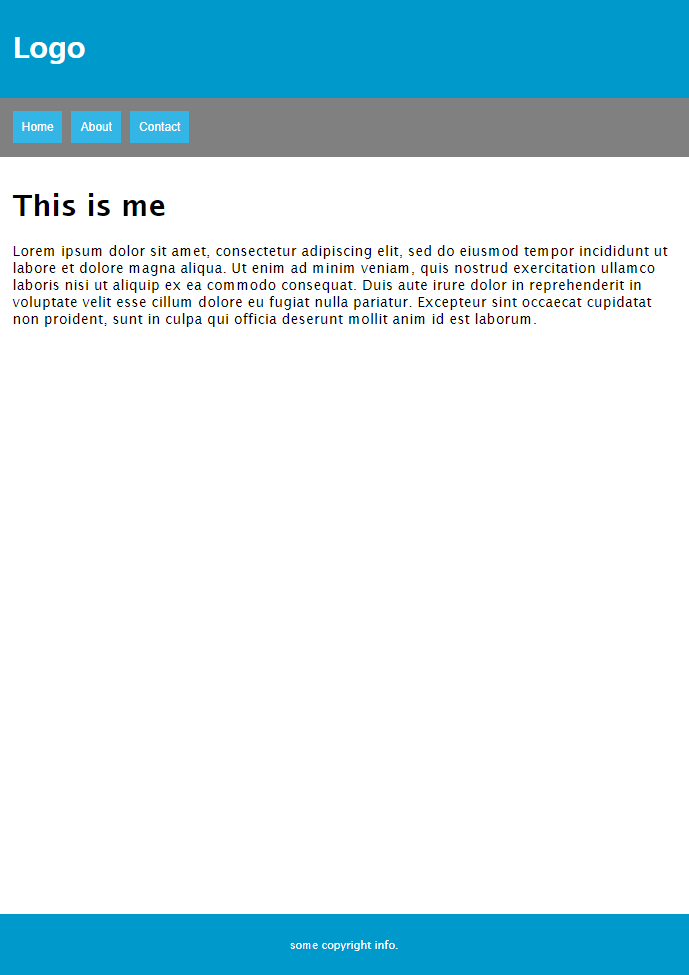

# Assignment - Add responsive styles to existing page

## Description

We have a basic layout, the client requested us to make sure the pages also look good on small devices.

This assignment is about implementing responsive design to the page. You will be implementing some specific styles for screens with 768 pixels in width or less.  

#

## Acceptance criteria

Implement responsive style for 768px

use: `@media only screen and (min-width : 768px)`

- On small screen remove skill box
- On small screen menu button should be above main text
	- Menu buttons should be next to each other
	- Menu buttons should be 10px apart
	- The background should be grey 
#

### Resource:

- [W3Schools - Css FlexBox](https://www.w3schools.com/css/css3_flexbox.asp)
- [W3Schools - Css Grid](https://www.w3schools.com/css/css_rwd_grid.asp)
- [W3Schools - Css mediaQueries](https://www.w3schools.com/css/css_rwd_mediaqueries.asp)

Happy coding! :) 

